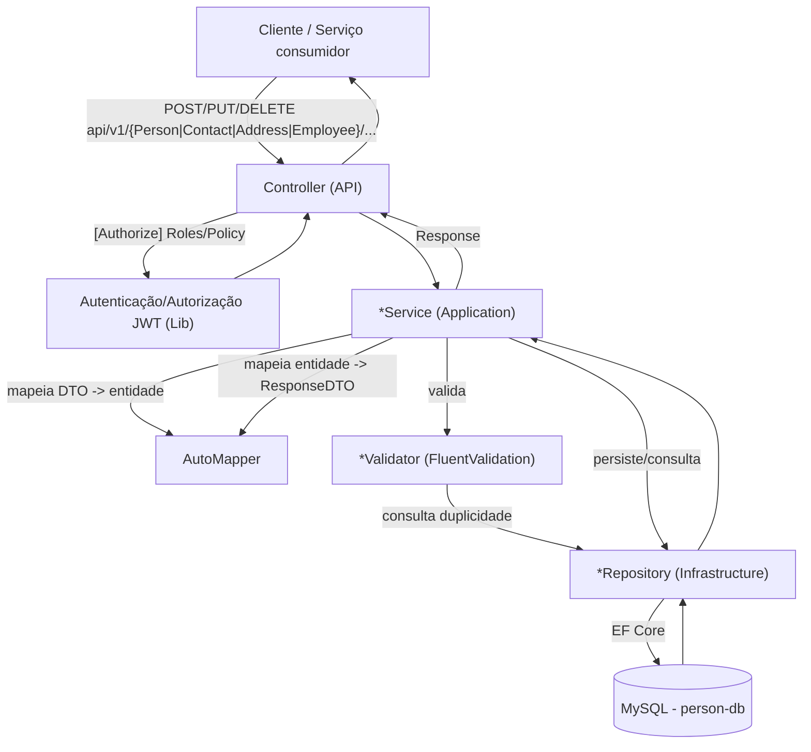
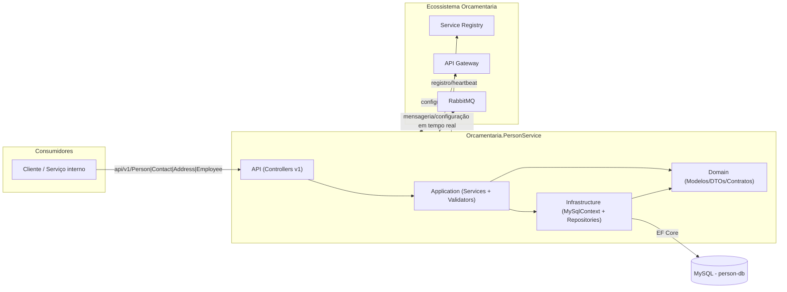
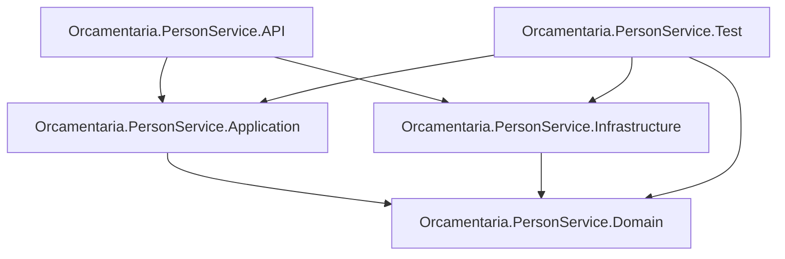

# 👤 Orcamentaria.PersonService

Microsserviço de **cadastro de pessoas** do ecossistema **Orcamentaria**, responsável por gerenciar Pessoas (clientes, fornecedores e funcionários), seus Endereços e Contatos, incluindo o cadastro especializado de Funcionários (`Employee`).

---

## 🎯 Objetivo

O `Orcamentaria.PersonService` centraliza o cadastro de pessoas físicas/jurídicas usadas pelo restante do ecossistema Orcamentaria:

1. Mantém o cadastro de **Pessoas** (`Person`), classificadas por tipo (`Client`, `Supplier`, `Employee`);
2. Mantém **Endereços** (`Address`) e **Contatos** (`Contact`) vinculados a cada pessoa, permitindo múltiplos registros com um marcado como padrão (`Default`);
3. Mantém o cadastro de **Funcionários** (`Employee`), uma especialização de `Person` com dados de vínculo empregatício (cargo, data de admissão e valor diário);
4. Expõe um endpoint de leitura (`GetForService`) protegido por política de serviço, para consumo por outros microsserviços do ecossistema;
5. Aplica regras de validação de negócio (unicidade de RG/CPF/CNPJ, obrigatoriedade e formato de campos) antes de persistir os dados.

---

## 🧰 Tecnologias

| Tecnologia | Versão | Finalidade |
|---|---|---|
| C# / .NET | 9 (API, Application, Domain, Infrastructure e Test) | Linguagem e runtime da aplicação |
| ASP.NET Core Web API | `Microsoft.NET.Sdk.Web` | Hospedagem HTTP |
| Entity Framework Core | 9.0.11 | ORM de acesso a dados |
| `MySql.EntityFrameworkCore` (Pomelo/Oracle provider) | 9.0.9 | Provider EF Core para MySQL |
| AutoMapper | 16.0.0 | Mapeamento entre entidades de domínio e DTOs |
| FluentValidation | 12.1.1 | Validação de regras de negócio das entidades |
| RabbitMQ.Client | 7.2.0 | Cliente de mensageria (referenciado na camada Application) |
| `Orcamentaria.Lib.Domain` | 10.1.1 | Modelos, enums, exceptions, contratos e validadores compartilhados do ecossistema |
| `Orcamentaria.Lib.Application` | 2.1.4 | Implementações compartilhadas de HTTP client, autenticação, cache e mensageria |
| `Orcamentaria.Lib.Infrastructure` | 5.4.0 | Composição de serviços e middlewares comuns a todos os serviços do ecossistema (incluindo `DbContext` com MySQL) |
| xUnit / NUnit / Moq / FluentAssertions | — | Stack de testes (`Orcamentaria.PersonService.Test`), com pacote de suporte `Orcamentaria.Lib.Test` |
| Docker / Docker Compose | — | Empacotamento e orquestração local (serviço + MySQL) |

---

## 🏗️ Arquitetura

O projeto segue uma **arquitetura em camadas**, apoiada na biblioteca interna compartilhada `Orcamentaria.Lib`, que concentra a infraestrutura transversal do ecossistema (autenticação JWT, Swagger, CORS, mensageria, cache, repositório genérico).

- **Domain**: modelos (`Person`, `Employee`, `Address`, `Contact`), enums (`PersonTypeEnum`, `ContactTypeEnum`), DTOs de entrada/saída, mapeamentos AutoMapper e contratos (`I*Repository`, `I*Service`), sem dependência de frameworks web ou de acesso a dados.
- **Application**: implementação dos serviços de negócio (`PersonService`, `ContactService`, `AddressService`, `EmployeeService`) e dos validadores FluentValidation (`PersonValidator`, `ContactValidator`, `AddressValidator`, `EmployeeValidator`).
- **Infrastructure**: `MySqlContext` (EF Core `DbContext`), `IEntityTypeConfiguration` de cada entidade e repositórios concretos que herdam de `BaseRepository<T>` (fornecido pela `Orcamentaria.Lib.Infrastructure`).
- **API**: Controllers versionados (`v1`), chaves públicas RSA para validação de token (`Keys/public_key_service.pem`, `Keys/public_key_user.pem`) e composição de injeção de dependência (`Startup.cs`).

Fluxo de dependência entre camadas: `API → Application → Infrastructure → Domain`, com `Application` e `Infrastructure` dependendo apenas de `Domain`.

`Employee` herda de `Person` (`Employee : Person`), tanto no modelo de domínio quanto no mapeamento EF Core, onde cada um é mapeado para sua própria tabela (`T_PERSON` e `T_EMPLOYEE`, ligadas por chave estrangeira 1‑para‑1 pelo `Id`).

---

## 📁 Estrutura do Projeto

```text
Orcamentaria.PersonService/
├── Orcamentaria.PersonService.API/             # Apresentação HTTP (composition root)
│   ├── Controllers/v1/PersonController.cs      #   Endpoints de Pessoa
│   ├── Controllers/v1/ContactController.cs     #   Endpoints de Contato
│   ├── Controllers/v1/AddressController.cs     #   Endpoints de Endereço
│   ├── Controllers/v1/EmployeeController.cs    #   Endpoints de Funcionário
│   ├── Keys/                                   #   Chaves públicas (RSA) para validação de token
│   ├── Program.cs / Startup.cs                 #   Bootstrap e injeção de dependências
│   └── appsettings*.json                       #   Configuração da aplicação
├── Orcamentaria.PersonService.Application/     # Regras de negócio
│   ├── Services/PersonService.cs, ContactService.cs, AddressService.cs, EmployeeService.cs
│   └── Validators/PersonValidator.cs, ContactValidator.cs, AddressValidator.cs, EmployeeValidator.cs
├── Orcamentaria.PersonService.Domain/          # Modelos, DTOs e contratos
│   ├── Models/Person.cs, Employee.cs, Address.cs, Contact.cs
│   ├── Enums/PersonTypeEnum.cs, ContactTypeEnum.cs
│   ├── DTOs/Person, Contact, Address, Employee   # *InsertDTO / *UpdateDTO / *ResponseDTO
│   ├── Mappers/PersonMapper.cs, ContactMapper.cs, AddressMapper.cs, EmployeeMapper.cs
│   ├── Repositories/IPersonRepository.cs, IContactRepository.cs, IAddressRepository.cs, IEmployeeRepository.cs
│   └── Services/IPersonService.cs, IContactService.cs, IAddressService.cs, IEmployeeService.cs
├── Orcamentaria.PersonService.Infrastructure/  # Acesso a dados
│   ├── Contexts/MySqlContext.cs                #   DbContext (DbSets Persons, Employees, Contacts, Addresses)
│   ├── Configurations/*.cs                     #   IEntityTypeConfiguration de cada entidade
│   └── Repositories/*.cs                       #   Implementações concretas (herdam BaseRepository<T>)
├── Orcamentaria.PersonService.Test/            # Testes (xUnit/NUnit + Moq + FluentAssertions)
│   ├── Fixtures/*.cs                           #   Geração de dados de teste (Person, Contact, Address, Employee)
│   ├── Contexts/MySqlContextTest.cs            #   DbContext de teste (para uso com provider InMemory)
│   ├── Repositories/*.cs, Services/*.cs, Validators/*.cs
├── mysql-init-scripts/create-person-db.sql     # Script de criação do schema/tabelas MySQL
├── compose.yaml                                # Orquestração local (MySQL + serviço)
├── Dockerfile                                  # Build/publicação da API
├── nuget.config                                # Fontes de pacotes NuGet (feed local + nuget.org)
└── Orcamentaria.PersonService.sln
```

---

## 🔄 Fluxo da Aplicação



**Passo a passo (exemplo: inserir uma Pessoa):**
1. O cliente chama `POST /api/v1/Person/Insert` com um `PersonInsertDTO`, autenticado via token JWT (usuário ou serviço) validado pela infraestrutura compartilhada.
2. `[Authorize(Roles = "MASTER,COMPANY_MASTER,PERSON:CREATE")]` garante que o chamador possui a role/permissão adequada antes de o Controller invocar `IPersonService`.
3. `PersonService.InsertAsync` usa o AutoMapper para converter o DTO em entidade `Person`.
4. `PersonValidator.ValidateBeforeInsert` executa as regras de negócio (campo obrigatório, tamanho, formato numérico de RG/CPF/CNPJ e verificação de duplicidade consultando o repositório).
5. Se válido, `PersonRepository.InsertAsync` persiste a entidade via EF Core no MySQL (`T_PERSON`), preenchendo automaticamente campos de auditoria/tenant herdados de `TenantEntity` (`CompanyId`, `CreatedAt`, `CreatedBy`, `UpdatedAt`, `UpdatedBy`).
6. A entidade persistida é mapeada para `PersonResponseDTO` e retornada envolta em um `Response<T>` padrão do ecossistema.

---

## 📦 Dependências principais

| Biblioteca | Uso no projeto |
|---|---|
| `Orcamentaria.Lib.Domain` | Modelos base (`TenantEntity`), contratos (`IValidatorEntity<T>`), `GridParams`/`FilterParam` (paginação/filtro/ordenação), `Response<T>`/`ResponsePagination` (envelope de resposta), exceptions de domínio (`DefaultException`, `InfoException`, `UnexpectedException`, `ValidationException`, `DatabaseException`) e `ErrorCodeEnum`. |
| `Orcamentaria.Lib.Application` | Serviços compartilhados (HTTP client, autenticação, cache, RabbitMQ) usados internamente pela infraestrutura comum. |
| `Orcamentaria.Lib.Infrastructure` | `ResolveCommonServicesWithMySql<TContext>`/`ConfigureCommon`, usados em `Startup.cs` para configurar `DbContext` MySQL, autenticação JWT, Swagger, CORS e middlewares comuns; `BaseRepository<T>`, herdado pelos repositórios concretos deste serviço, provendo CRUD genérico com paginação/filtro/ordenação e escopo por tenant (`CompanyId`). |
| `Microsoft.EntityFrameworkCore` + `MySql.EntityFrameworkCore` | Mapeamento objeto-relacional das entidades `Person`, `Employee`, `Address` e `Contact` para o MySQL. |
| `AutoMapper` | Perfis `PersonMapper`, `ContactMapper`, `AddressMapper`, `EmployeeMapper`, convertendo entre entidades e DTOs de Insert/Update/Response. |
| `FluentValidation` | Validadores de cada entidade, incluindo regras de duplicidade que consultam o repositório correspondente. |

---

## ⚙️ Configuração

A aplicação usa o modelo padrão de configuração do ASP.NET Core (`appsettings.json` + `appsettings.{Environment}.json` + variáveis de ambiente).

**`Orcamentaria.PersonService.API/appsettings.json`** define:
- `Logging`: níveis padrão de log (`Default: Information`, `Microsoft.AspNetCore: Warning`);
- `ApiGetawayConfiguration.BaseUrl`: endereço do `Orcamentaria.APIGetaway`, usado pela infraestrutura compartilhada para obter configuração remota e rotear chamadas de saída;
- um valor de bootstrap (chave `BOOTSTRAPSECRET`) usado internamente pela biblioteca compartilhada para autenticar a busca de configuração remota do serviço junto ao `Orcamentaria.ConfigBagService` (o valor real não é reproduzido aqui por se tratar de segredo).

**`Orcamentaria.PersonService.API/appsettings.Development.json`**: contém overrides de `Logging` para o ambiente de desenvolvimento.

As demais configurações do serviço — `ServiceRegistryConfiguration`, `MessageBrokerConfiguration`, `ServiceConfiguration` e a connection string do MySQL — não ficam no `appsettings.json` local: são buscadas no `ConfigBagService` via API Gateway durante o bootstrap. `ApiGetawayConfiguration.BaseUrl` e `BOOTSTRAPSECRET` são as exceções que permanecem locais, por serem o necessário para localizar o Gateway e se autenticar antes dessa busca.

---

## 🔑 Variáveis de Ambiente

| Variável | Descrição |
|---|---|
| `ASPNETCORE_ENVIRONMENT` | Define o ambiente ASP.NET Core (perfis locais em `launchSettings.json` usam `Prod`). |
| `ApiGetawayConfiguration__BaseUrl` | URL do API Gateway usada para descoberta/roteamento e obtenção de configuração remota. |
| `ConnectionStrings__DefaultConnection` | String de conexão MySQL usada pelo `MySqlContext` (definida como variável de ambiente no `compose.yaml`, sem valor fixo no `appsettings.json`). |
| `ASPNETCORE_URLS` | Endereço(s) em que o Kestrel escuta (usado no `compose.yaml` para expor a porta do container). |
| `MessageBrokerConfiguration__Host` / `__Port` / `__UserName` / `__Password` | Parâmetros de conexão com o RabbitMQ usados pela infraestrutura compartilhada. |

---

## 🗄️ Banco de Dados

O serviço usa **MySQL** via **Entity Framework Core** (`MySql.EntityFrameworkCore`), com o `DbContext` `MySqlContext` definindo os `DbSet`s `Persons`, `Employees`, `Contacts` e `Addresses`.

**Tabelas mapeadas pelas `IEntityTypeConfiguration`:**

| Tabela | Entidade | Observações |
|---|---|---|
| `T_PERSON` | `Person` | Chave primária `ID`; colunas `NAME`, `RG`, `CPF`, `CNPJ`, `TYPE`, `COMPANY_ID`, `ACTIVE`, além dos campos de auditoria (`CREATED_AT`, `CREATED_BY`, `UPDATED_AT`, `UPDATED_BY`); relaciona-se com `T_ADDRESS` (`fk_T_ADDRESS_T_PERSON`) e `T_CONTACT` (`fk_T_CONTACT_T_PERSON`). |
| `T_EMPLOYEE` | `Employee` (herda de `Person`) | Colunas próprias `POST`, `ADMISSION_DATE`, `VALUE_PER_DAY`; a chave (`ID`) é compartilhada com `T_PERSON` via relacionamento configurado em `EmployeeConfiguration`. |
| `T_ADDRESS` | `Address` | Colunas `STREET`, `ZIPCODE`, `NUMBER`, `COMPLEMENT`, `NEIHBORHOOD`, `CITY`, `STATE`, `UF`, `DEFAULT`, `PERSON_ID`, além dos campos de tenant/auditoria. |
| `T_CONTACT` | `Contact` | Colunas `CONTACT`, `TYPE`, `DEFAULT`, `PERSON_ID`, além dos campos de tenant/auditoria. |

O diretório `mysql-init-scripts/create-person-db.sql` contém o script (gerado via MySQL Workbench) de criação do schema `person-db` e das tabelas `T_PERSON`, `T_ADDRESS`, `T_CONTACT` e `T_EMPLOYEE` com suas chaves estrangeiras, montado automaticamente no container MySQL do `compose.yaml` (via `docker-entrypoint-initdb.d`) na primeira inicialização do volume.

---

## ▶️ Como Executar

### Pré-requisitos
- [.NET SDK 9.0](https://dotnet.microsoft.com/download)
- MySQL acessível (local, container ou remoto), com a base `person-db` provisionada
- Service Registry e API Gateway do ecossistema em execução e acessíveis
- RabbitMQ acessível (usado pela infraestrutura compartilhada)

### Localmente

```bash
git clone <url-do-repositorio>
cd Orcamentaria.PersonService

dotnet restore
dotnet build

dotnet run --project Orcamentaria.PersonService.API
```

A API sobe, por padrão, em `http://localhost:5157` (perfil HTTPS: `https://localhost:7075;http://localhost:5157`), abrindo automaticamente o navegador em `/swagger`.

### Via Docker / Docker Compose

O `compose.yaml` sobe um container MySQL (`mysql:8.0`, com o schema `person-db` provisionado pelos scripts em `mysql-init-scripts/`) e o container do serviço, construído a partir do `Dockerfile` local:

```bash
docker compose up --build
```

O serviço fica acessível na porta `5000` do host, conforme mapeamento `ports: "5000:5000"` e `ASPNETCORE_URLS=http://+:5000` definidos no `compose.yaml`. As credenciais de banco e broker são fornecidas via variáveis de ambiente no próprio `compose.yaml`.

---

## 🧪 Como Rodar Testes

O projeto `Orcamentaria.PersonService.Test` referencia **xUnit**, **NUnit**, **Moq**, **FluentAssertions** e o pacote de suporte `Orcamentaria.Lib.Test`, além de um `MySqlContextTest` (subclasse de `MySqlContext`) usado para testes de repositório.

```bash
dotnet test
```

Para gerar relatório de cobertura:

```bash
dotnet test --collect:"XPlat Code Coverage"
```

**Cobertura por camada testada:**

| Pasta de teste | Alvo |
|---|---|
| `Fixtures/*.cs` | Geração de dados de teste para `Person`, `Contact`, `Address` e `Employee` |
| `Repositories/*.cs` | `PersonRepository`, `ContactRepository`, `AddressRepository`, `EmployeeRepository` |
| `Services/*.cs` | `PersonService`, `ContactService`, `AddressService`, `EmployeeService` |
| `Validators/*.cs` | `PersonValidator`, `ContactValidator`, `AddressValidator`, `EmployeeValidator` |
| `Contexts/MySqlContextTest.cs` | Contexto de dados usado como base para os testes de repositório |

---

## 🧭 APIs

### Swagger / OpenAPI
O Swagger está habilitado em ambiente de desenvolvimento, acessível em `/swagger`.

### Endpoints

| Método | Rota | Autorização | Descrição |
|---|---|---|---|
| `POST` | `/api/v1/Person/Get` | Roles: `MASTER,COMPANY_MASTER,PERSON:READ` | Lista pessoas paginadas/filtradas (`GridParams`), incluindo endereços e contatos. |
| `POST` | `/api/v1/Person/Insert` | Roles: `MASTER,COMPANY_MASTER,PERSON:CREATE` | Cadastra uma nova pessoa (`PersonInsertDTO`). |
| `PUT` | `/api/v1/Person/Update/{id}` | Roles: `MASTER,COMPANY_MASTER,PERSON:UPDATE` | Atualiza uma pessoa existente (`PersonUpdateDTO`). |
| `POST` | `/api/v1/Person/GetForService` | Policy: `ServicePolicy` | Lista pessoas para consumo por outros serviços do ecossistema (retorna apenas o endereço e o contato marcados como padrão). |
| `POST` | `/api/v1/Contact/Get` | Roles: `MASTER,COMPANY_MASTER,PERSON:READ` | Lista contatos paginados/filtrados. |
| `POST` | `/api/v1/Contact/Insert` | Roles: `MASTER,COMPANY_MASTER,PERSON:INSERT` | Cadastra um novo contato (`ContactInsertDTO`). |
| `PUT` | `/api/v1/Contact/Update/{id}` | Roles: `MASTER,COMPANY_MASTER,PERSON:UPDATE` | Atualiza um contato existente (`ContactUpdateDTO`). |
| `DELETE` | `/api/v1/Contact/Delete/{id}` | Roles: `MASTER,COMPANY_MASTER,PERSON:DELETE` | Remove um contato. |
| `POST` | `/api/v1/Address/Get` | Roles: `MASTER,COMPANY_MASTER,PERSON:READ` | Lista endereços paginados/filtrados. |
| `POST` | `/api/v1/Address/Insert` | Roles: `MASTER,COMPANY_MASTER,PERSON:INSERT` | Cadastra um novo endereço (`AddressInsertDTO`). |
| `PUT` | `/api/v1/Address/Update/{id}` | Roles: `MASTER,COMPANY_MASTER,PERSON:UPDATE` | Atualiza um endereço existente (`AddressUpdateDTO`). |
| `DELETE` | `/api/v1/Address/Delete/{id}` | Roles: `MASTER,COMPANY_MASTER,PERSON:DELETE` | Remove um endereço. |
| `POST` | `/api/v1/Employee/Get` | Roles: `MASTER,COMPANY_MASTER,PERSON:READ` | Lista funcionários paginados/filtrados, incluindo endereços e contatos. |
| `POST` | `/api/v1/Employee/Insert` | Roles: `MASTER,COMPANY_MASTER,PERSON:CREATE` | Cadastra um novo funcionário (`EmployeeInsertDTO`), fixando automaticamente `Type = Employee`. |
| `PUT` | `/api/v1/Employee/Update/{id}` | Roles: `MASTER,COMPANY_MASTER,PERSON:UPDATE` | Atualiza um funcionário existente (`EmployeeUpdateDTO`). |

---

## 🔗 Integrações

| Integração | Descrição |
|---|---|
| **Service Registry** | O serviço se registra e mantém heartbeat junto ao Service Registry, permitindo que o API Gateway descubra suas instâncias e endpoints. |
| **API Gateway (`Orcamentaria.APIGetaway`)** | Endereço configurado em `ApiGetawayConfiguration.BaseUrl`, usado como intermediário para a busca de configuração remota e como ponto de entrada para chamadas de outros serviços/clientes. |
| **ConfigBagService** | Fonte centralizada da configuração do serviço (connection string, Service Registry, mensageria), buscada via API Gateway durante o bootstrap. |
| **RabbitMQ** | Usado pela infraestrutura compartilhada para mensageria (publicação de mensagens e recebimento de atualizações de configuração em tempo real). |
| **Serviços consumidores** | O endpoint `POST /api/v1/Person/GetForService`, protegido por `ServicePolicy`, foi criado especificamente para ser consumido por outros microsserviços do ecossistema que precisem de dados de pessoas. |

---

## 📈 Logs

Logging via `Microsoft.Extensions.Logging`, configurado em `appsettings.json`:

```json
"Logging": {
  "LogLevel": {
    "Default": "Information",
    "Microsoft.AspNetCore": "Warning"
  }
}
```

---

## 🚨 Tratamento de Erros

Os serviços de Application capturam exceções de negócio conhecidas (`DefaultException` e suas especializações, como `InfoException` para "nenhum dado encontrado" e `ValidationException` para falhas de validação) e as relançam, enquanto qualquer outra exceção não prevista é encapsulada em `UnexpectedException`. Esse tratamento é padronizado em todos os métodos de `PersonService`, `ContactService`, `AddressService` e `EmployeeService`. O formato final da resposta de erro (JSON com código de status HTTP apropriado) é produzido por um middleware central fornecido pela infraestrutura compartilhada.

---

## 🔐 Segurança

O serviço participa da infraestrutura de autenticação do ecossistema baseada em **JWT (RS256)**, validado a partir de chaves públicas RSA embarcadas como recursos do projeto (`Keys/public_key_service.pem`, `Keys/public_key_user.pem`).

Os endpoints usam `[Authorize]` com dois modelos de controle de acesso:
- **Roles** granulares (ex.: `MASTER`, `COMPANY_MASTER`, `PERSON:READ`, `PERSON:CREATE`, `PERSON:INSERT`, `PERSON:UPDATE`, `PERSON:DELETE`) para operações acionadas por usuários finais;
- **Policy** `ServicePolicy` para o endpoint `Person/GetForService`, destinado à comunicação serviço-a-serviço autenticada por token de serviço.

Os dados são segregados por tenant através do campo `CompanyId`, herdado de `TenantEntity` e aplicado automaticamente pelo repositório genérico da infraestrutura compartilhada nas operações de leitura e escrita (exceto no fluxo `GetForService`, cujo repositório usa uma variante de consulta sem esse filtro).

---

## 🧩 Padrões Encontrados

| Padrão | Onde aparece |
|---|---|
| **Repository** | `I*Repository<T>` (Domain) implementados por `*Repository` (Infrastructure), que herdam `BaseRepository<T>` da biblioteca compartilhada. |
| **Dependency Injection** | Serviços, validadores, repositórios e mapeadores registrados via `IServiceCollection` em `Startup.cs` e injetados por construtor. |
| **DTO** | `*InsertDTO` / `*UpdateDTO` / `*ResponseDTO` para cada entidade, isolando o contrato de API do modelo de domínio. |
| **Object Mapper** | Perfis do AutoMapper (`PersonMapper`, `ContactMapper`, `AddressMapper`, `EmployeeMapper`) convertendo entre entidades e DTOs. |
| **Validator / Strategy de validação** | `IValidatorEntity<T>` (Lib.Domain) implementado por validadores FluentValidation dedicados por entidade, com regras comuns (`CommonValidation`) reaproveitadas entre inserção e atualização. |
| **Template Method** | `ValidateBeforeInsert`/`ValidateBeforeUpdate` reaproveitando `CommonValidation` e adicionando regras específicas de cada fluxo. |
| **Herança de entidades (Table-per-Type)** | `Employee : Person`, mapeado em tabelas separadas (`T_PERSON`/`T_EMPLOYEE`) via Fluent API do EF Core. |
| **Response Wrapper** | `Response<T>` (Lib.Domain) como envelope padrão de todas as respostas de sucesso/erro da API. |

---

## 📊 Diagrama de Arquitetura



---

## 🧱 Dependências entre Módulos



---

## 📝 Resumo Executivo

O **Orcamentaria.PersonService** é o microsserviço de cadastro de pessoas do ecossistema Orcamentaria, construído em .NET 9 com ASP.NET Core Web API e Entity Framework Core sobre MySQL. Expõe endpoints para gerenciar Pessoas (`Person`), Endereços (`Address`), Contatos (`Contact`) e Funcionários (`Employee` — uma especialização de `Person`), com um endpoint adicional (`Person/GetForService`) dedicado à integração com outros serviços do ecossistema.

A solução é organizada em camadas (`API → Application → Infrastructure → Domain`), apoiada na biblioteca compartilhada `Orcamentaria.Lib`, que fornece autenticação JWT (RS256), Swagger, CORS, repositório genérico com escopo multi-tenant e integração com RabbitMQ. As regras de negócio (obrigatoriedade, formato e unicidade de campos como RG/CPF/CNPJ) são aplicadas via FluentValidation antes da persistência, e o mapeamento entre entidades e DTOs é feito com AutoMapper. O projeto conta com testes cobrindo repositórios, serviços e validadores das quatro entidades, e pode ser executado localmente via `dotnet run` ou via Docker Compose, que já provisiona um container MySQL com o schema `person-db`.
